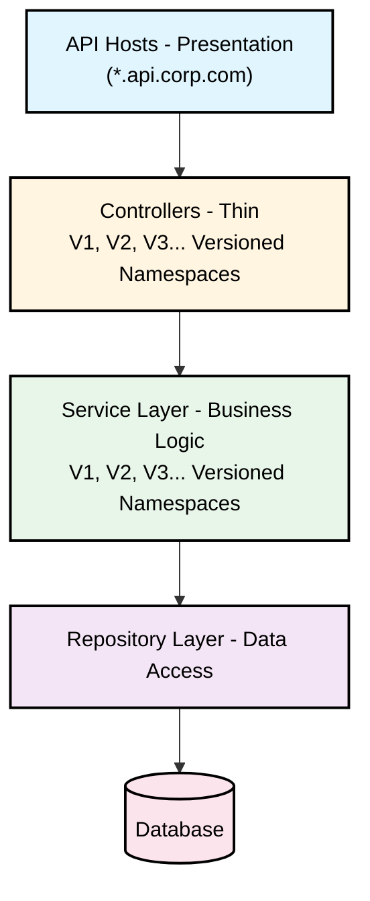
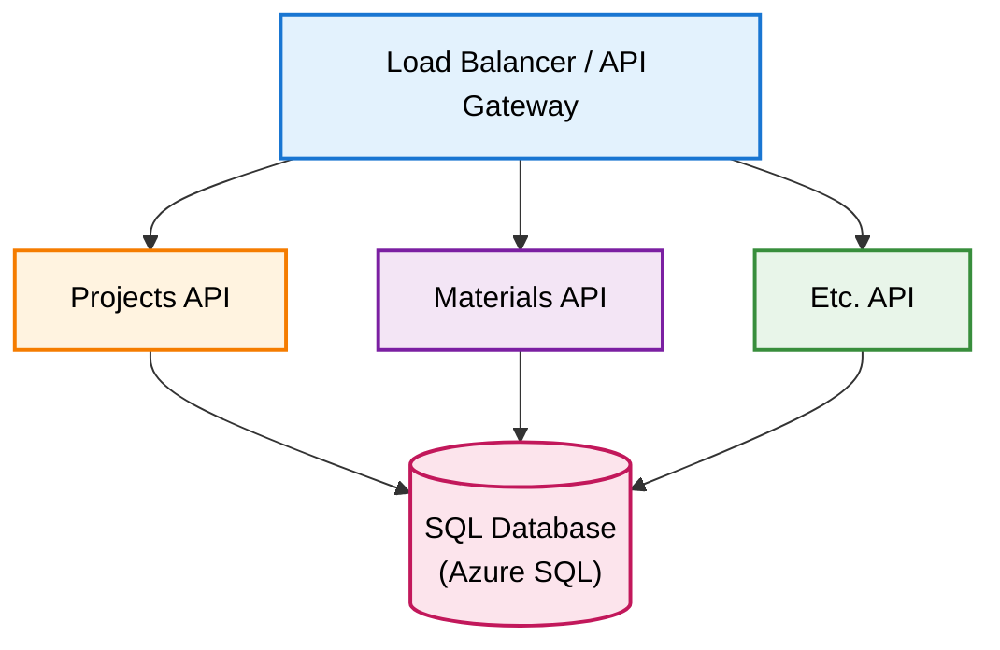

# DataLayer Solution - Architecture Documentation

## Overview

This solution implements a multi-host REST API architecture using ASP.NET Core (.NET 8) with a clean, layered design pattern. The API surface is split across multiple domain-specific hosts, each implementing versioned endpoints using Microsoft.AspNetCore.Mvc.Versioning.

## High-Level Architecture



---

## Solution Structure

```
DataLayer.sln
│
├── src/
│   ├── DataLayer.Core/                    # Shared domain models, interfaces, enums
│   ├── DataLayer.Infrastructure/          # Data access, repositories, DbContext
│   ├── DataLayer.Services/                # Business logic services
│   ├── DataLayer.Api.Projects/            # Projects API host
│   └── DataLayer.Api.Etc/                 # Each other API host
│
├── tests/
│   ├── DataLayer.Core.Tests/
│   ├── DataLayer.Services.Tests/
│   ├── DataLayer.Api.Projects.Tests/
│   ├── DataLayer.Api.Materials.Tests/
│   └── DataLayer.Api.Logistics.Tests/
│
├── docs/                                  # Additional documentation
└── ARCHITECTURE.md                        # This file
```

---

## Project Descriptions

### 1. DataLayer.Core (Class Library)

**Purpose**: Contains shared domain models, DTOs, interfaces, enums, and common utilities used across all layers.

**Structure**:
```
DataLayer.Core/
├── DataLayer.Core.csproj
│
├── Entities/                              # Domain entities
│   ├── Project.cs
│   ├── Etc.cs
│   └── BaseEntity.cs
│
├── Interfaces/
│   ├── IRepository.cs                     # Generic repository interface
│   ├── Repositories/                      # Specific repository interfaces
│   │   ├── IProjectRepository.cs
│   │   └── IEtcRepository.cs
│   │
│   └── Services/                          # Service interfaces
│       ├── V1/
│       │   ├── IProjectService.cs
│       │   └── IEtcService.cs
│       └── V2/
│           ├── IProjectService.cs
│           └── IEtcService.cs
│
├── DTOs/                                  # Data Transfer Objects
│   ├── V1/
│   │   ├── ProjectDto.cs
│   │   └── EtcDto.cs
│   └── V2/
│       ├── ProjectDto.cs
│       └── EtcDto.cs
│
├── Enums/
│   ├── ProjectStatus.cs
│   ├── MaterialType.cs
│   └── OrderStatus.cs
│
├── Exceptions/
│   ├── NotFoundException.cs
│   ├── ValidationException.cs
│   └── BusinessRuleException.cs
│
└── Constants/
    └── ApiConstants.cs
```

**Key Files**:

- **BaseEntity.cs**: Abstract base class with common properties (Id, CreatedDate, ModifiedDate, etc.)
- **IRepository.cs**: Generic repository interface with CRUD operations
- **IProjectService.cs**: Interface defining project service operations for a specific version
- **ProjectDto.cs**: Data transfer object for project data, versioned by namespace
- **NotFoundException.cs**: Custom exception for resource not found scenarios
- **ApiConstants.cs**: API-wide constants (route prefixes, default values, etc.)

---

### 2. DataLayer.Infrastructure (Class Library)

**Purpose**: Implements data access layer using Entity Framework Core, including DbContext, repositories, and database migrations.

**Structure**:
```
DataLayer.Infrastructure/
├── DataLayer.Infrastructure.csproj
├── Data/
│   ├── ApplicationDbContext.cs            # EF Core DbContext
│   ├── Configurations/                    # Entity configurations
│   │   ├── ProjectConfiguration.cs
│   │   ├── MaterialConfiguration.cs
│   │   └── LogisticsOrderConfiguration.cs
│   └── Migrations/                        # EF Core migrations
│
├── Repositories/
│   ├── Repository.cs                      # Generic repository implementation
│   ├── ProjectRepository.cs
│   └── EtcRepository.cs
│
└── Extensions/
    └── ServiceCollectionExtensions.cs     # DI registration for infrastructure
```

**Key Files**:

- **ApplicationDbContext.cs**: EF Core DbContext with DbSet properties for each entity
- **Repository.cs**: Generic implementation of IRepository<T> with base CRUD operations
- **ProjectRepository.cs**: Implements IProjectRepository with project-specific queries
- **ProjectConfiguration.cs**: Fluent API configuration for Project entity (table mapping, relationships, indexes)
- **ServiceCollectionExtensions.cs**: Extension methods to register DbContext and repositories with DI container

---

### 3. DataLayer.Services (Class Library)

**Purpose**: Contains business logic and service implementations. Services are organized by version in separate namespaces/folders.

**Structure**:
```
DataLayer.Services/
├── DataLayer.Services.csproj
├── V1/
│   ├── ProjectService.cs
│   └── EtcService.cs
│
├── V2/
│   ├── ProjectService.cs
│   └── EtcService.cs
│
├── Mapping/
│   ├── V1/
│   │   └── MappingProfile.cs             # AutoMapper profile for V1 DTOs
│   └── V2/
│       └── MappingProfile.cs             # AutoMapper profile for V2 DTOs
│
├── Validators/
│   ├── V1/
│   │   ├── ProjectValidator.cs           # FluentValidation validators
│   │   └── EtcValidator.cs
│   └── V2/
│       ├── ProjectValidator.cs
│       └── EtcValidator.cs
│
└── Extensions/
    └── ServiceCollectionExtensions.cs     # DI registration for services
```

**Key Files**:

- **V1/ProjectService.cs**: Implements IProjectService for API version 1, contains business logic for project operations
- **V2/ProjectService.cs**: Implements IProjectService for API version 2, may have enhanced or different business rules
- **V1/MappingProfile.cs**: AutoMapper configuration to map between V1 entities and DTOs
- **V1/ProjectValidator.cs**: FluentValidation rules for validating V1 project DTOs
- **ServiceCollectionExtensions.cs**: Registers all versioned services, AutoMapper profiles, and validators

---

### 4. DataLayer.Api.Projects (ASP.NET Core Web API)

**Purpose**: API host for project-related endpoints, hosted at projects.api.corp.com

**Structure**:
```
DataLayer.Api.Projects/
├── DataLayer.Api.Projects.csproj
├── Program.cs                             # Application entry point and startup
├── appsettings.json
├── appsettings.Development.json
│
├── Controllers/
│   ├── V1/
│   │   └── ProjectsController.cs         # V1 project endpoints
│   ├── V2/
│   │   └── ProjectsController.cs         # V2 project endpoints
│   └── V3/
│       └── ProjectsController.cs         # V3 project endpoints (future)
│
├── Middleware/
│   ├── ExceptionHandlingMiddleware.cs    # Global exception handling
│   └── RequestLoggingMiddleware.cs       # Request/response logging
│
├── Filters/
│   └── ValidationFilter.cs               # Model validation filter
│
└── Extensions/
    └── ServiceCollectionExtensions.cs    # API-specific service registration
```

**Key Files**:

- **Program.cs**: Configures services (DI, versioning, Swagger, CORS, authentication), middleware pipeline, and runs the application
- **V1/ProjectsController.cs**: Thin controller with API v1 endpoints (GET, POST, PUT, DELETE), delegates to IProjectService (V1)
- **V2/ProjectsController.cs**: Controller with API v2 endpoints, may have different routes or additional operations
- **ExceptionHandlingMiddleware.cs**: Catches exceptions and returns standardized error responses
- **appsettings.json**: Configuration for connection strings, logging, API keys, versioning settings

**Example Controller Structure**:
```
Namespace: DataLayer.Api.Projects.Controllers.V1
Route: api/v{version:apiVersion}/projects
API Version: 1.0

Endpoints:
- GET    /api/v1/projects              # Get all projects
- GET    /api/v1/projects/{id}         # Get project by ID
- POST   /api/v1/projects              # Create new project
- PUT    /api/v1/projects/{id}         # Update project
- DELETE /api/v1/projects/{id}         # Delete project
```

---

### 5. DataLayer.Api.Materials (ASP.NET Core Web API)

**Purpose**: API host for material-related endpoints, hosted at materials.api.corp.com

**Structure**:
```
DataLayer.Api.Materials/
├── DataLayer.Api.Materials.csproj
├── Program.cs
├── appsettings.json
├── appsettings.Development.json
│
├── Controllers/
│   ├── V1/
│   │   └── MaterialsController.cs
│   ├── V2/
│   │   └── MaterialsController.cs
│   └── V3/
│       └── MaterialsController.cs
│
├── Middleware/
│   ├── ExceptionHandlingMiddleware.cs
│   └── RequestLoggingMiddleware.cs
│
├── Filters/
│   └── ValidationFilter.cs
│
└── Extensions/
    └── ServiceCollectionExtensions.cs
```

**Key Files**:

- **Program.cs**: Similar to Projects API, configures versioning, Swagger, middleware for materials domain
- **V1/MaterialsController.cs**: Thin controller for material operations (V1), delegates to IMaterialService (V1)
- **V2/MaterialsController.cs**: Enhanced material endpoints for API v2
- **ExceptionHandlingMiddleware.cs**: Global exception handling specific to materials API
- **appsettings.json**: Configuration for materials API (can have different DB connection, logging levels, etc.)

**Example Controller Structure**:
```
Namespace: DataLayer.Api.Materials.Controllers.V1
Route: api/v{version:apiVersion}/materials
API Version: 1.0

Endpoints:
- GET    /api/v1/materials              # Get all materials
- GET    /api/v1/materials/{id}         # Get material by ID
- POST   /api/v1/materials              # Create new material
- PUT    /api/v1/materials/{id}         # Update material
- DELETE /api/v1/materials/{id}         # Delete material
- GET    /api/v1/materials/search       # Search materials
```

---

### 6. DataLayer.Api.Logistics (ASP.NET Core Web API)

**Purpose**: API host for logistics/order-related endpoints, hosted at logistics.api.corp.com

**Structure**:
```
DataLayer.Api.Logistics/
├── DataLayer.Api.Logistics.csproj
├── Program.cs
├── appsettings.json
├── appsettings.Development.json
│
├── Controllers/
│   ├── V1/
│   │   ├── OrdersController.cs
│   │   └── ShipmentsController.cs
│   ├── V2/
│   │   ├── OrdersController.cs
│   │   └── ShipmentsController.cs
│   └── V3/
│       ├── OrdersController.cs
│       └── ShipmentsController.cs
│
├── Middleware/
│   ├── ExceptionHandlingMiddleware.cs
│   └── RequestLoggingMiddleware.cs
│
├── Filters/
│   └── ValidationFilter.cs
│
└── Extensions/
    └── ServiceCollectionExtensions.cs
```

**Key Files**:

- **Program.cs**: Configures logistics API with versioning, Swagger, and domain-specific middleware
- **V1/OrdersController.cs**: Thin controller for logistics order operations (V1)
- **V1/ShipmentsController.cs**: Controller for shipment tracking and management (V1)
- **V2/OrdersController.cs**: Enhanced orders API with additional features in v2
- **appsettings.json**: Configuration for logistics API

**Example Controller Structure**:
```
Namespace: DataLayer.Api.Logistics.Controllers.V1
Routes:
  - api/v{version:apiVersion}/orders
  - api/v{version:apiVersion}/shipments
API Version: 1.0

Endpoints (Orders):
- GET    /api/v1/orders                 # Get all orders
- GET    /api/v1/orders/{id}            # Get order by ID
- POST   /api/v1/orders                 # Create new order
- PUT    /api/v1/orders/{id}            # Update order
- PUT    /api/v1/orders/{id}/status     # Update order status

Endpoints (Shipments):
- GET    /api/v1/shipments              # Get all shipments
- GET    /api/v1/shipments/{id}         # Get shipment by ID
- POST   /api/v1/shipments              # Create shipment
- PUT    /api/v1/shipments/{id}/track   # Update tracking info
```

---

## Test Projects

### Test Project Structure

Each test project follows the same structure pattern:

```
DataLayer.[ProjectName].Tests/
├── DataLayer.[ProjectName].Tests.csproj
├── Unit/                                  # Unit tests
│   ├── Services/
│   │   └── [Service]Tests.cs
│   ├── Controllers/
│   │   └── [Controller]Tests.cs
│   └── Repositories/
│       └── [Repository]Tests.cs
│
├── Integration/                           # Integration tests
│   └── Api/
│       └── [Controller]IntegrationTests.cs
│
├── Fixtures/                              # Test fixtures and helpers
│   ├── DatabaseFixture.cs
│   └── TestDataBuilder.cs
│
└── Mocks/                                 # Mock objects
    └── MockRepository.cs
```

---

## Key Technical Implementations

### 1. API Versioning Configuration

**Location**: Each API host's Program.cs

```csharp
// Configuration details:
- Uses Microsoft.AspNetCore.Mvc.Versioning
- URL path versioning: /api/v{version}/resource
- Versions declared in controller attributes: [ApiVersion("1.0")]
- Default version: 1.0
- Version reporting enabled in headers
- Deprecated versions supported with warnings
```

**Example**:
```
services.AddApiVersioning(options =>
{
    options.AssumeDefaultVersionWhenUnspecified = true;
    options.DefaultApiVersion = new ApiVersion(1, 0);
    options.ReportApiVersions = true;
    options.ApiVersionReader = new UrlSegmentApiVersionReader();
});

services.AddVersionedApiExplorer(options =>
{
    options.GroupNameFormat = "'v'VVV";
    options.SubstituteApiVersionInUrl = true;
});
```

### 2. Swagger/OpenAPI Configuration

**Location**: Each API host's Program.cs

```csharp
// Configuration details:
- Microsoft.AspNetCore.OpenApi / Swashbuckle.AspNetCore
- Separate Swagger document for each API version
- Available at: /swagger/v1/swagger.json, /swagger/v2/swagger.json
- UI available at: /swagger
- Includes XML comments for documentation
- Bearer token authentication support
```

**Endpoints**:
```
Projects API:  https://projects.api.corp.com/swagger
Materials API: https://materials.api.corp.com/swagger
Logistics API: https://logistics.api.corp.com/swagger
```

### 3. Dependency Injection Structure

**Registration Order** (in Program.cs of each API host):

1. **Infrastructure Layer**: DbContext, Repositories
2. **Service Layer**: Business services, AutoMapper, FluentValidation
3. **API Layer**: Controllers, Filters, API versioning, Swagger
4. **Cross-Cutting**: Logging, CORS, Authentication, Health checks

**Extension Methods**:
- `DataLayer.Infrastructure.Extensions.ServiceCollectionExtensions.AddInfrastructure()`
- `DataLayer.Services.Extensions.ServiceCollectionExtensions.AddServices()`
- `DataLayer.Api.[Host].Extensions.ServiceCollectionExtensions.AddApiServices()`

### 4. Thin Controllers Pattern

**Purpose**: Controllers contain minimal logic - only routing, model binding, and validation

**Responsibilities**:
- Accept HTTP requests
- Validate model state
- Call appropriate service method
- Return appropriate HTTP status code
- Transform service results to action results

**Example Flow**:
```
HTTP Request
  → Controller (validation, routing)
    → Service (business logic)
      → Repository (data access)
        → Database
      ← Repository (entities)
    ← Service (DTOs)
  ← Controller (HTTP response)
HTTP Response
```

### 5. Versioning Strategy

**Namespace Structure**:
```
DataLayer.Core.Interfaces.Services.V1.IProjectService
DataLayer.Core.Interfaces.Services.V2.IProjectService
DataLayer.Services.V1.ProjectService
DataLayer.Services.V2.ProjectService
DataLayer.Api.Projects.Controllers.V1.ProjectsController
DataLayer.Api.Projects.Controllers.V2.ProjectsController
```

**Version Lifecycle**:
1. **V1**: Initial implementation
2. **V2**: Enhanced features, may deprecate V1
3. **V3**: Major changes, V1 marked deprecated
4. **V1 Sunset**: Eventually removed after deprecation period

### 6. Error Handling

**Global Exception Handling**: ExceptionHandlingMiddleware in each API host

**Response Format**:
```json
{
  "type": "https://tools.ietf.org/html/rfc7231#section-6.5.4",
  "title": "Not Found",
  "status": 404,
  "detail": "Project with ID 123 was not found",
  "traceId": "00-abc123...",
  "errors": {}
}
```

**Exception Types**:
- NotFoundException → 404
- ValidationException → 400
- BusinessRuleException → 422
- UnauthorizedException → 401
- Unhandled → 500

---

## Configuration Files

### appsettings.json (per API host)

```json
{
  "ConnectionStrings": {
    "DefaultConnection": "Server=...;Database=...;"
  },
  "Logging": {
    "LogLevel": {
      "Default": "Information",
      "Microsoft.AspNetCore": "Warning"
    }
  },
  "ApiVersioning": {
    "DefaultVersion": "1.0",
    "AssumeDefaultVersion": true,
    "ReportVersions": true
  },
  "Swagger": {
    "Title": "Projects API",
    "Description": "API for managing projects",
    "ContactName": "API Support",
    "ContactEmail": "support@corp.com"
  },
  "Cors": {
    "AllowedOrigins": ["https://app.corp.com"]
  },
  "AllowedHosts": "*"
}
```

### Directory.Build.props (Solution-level)

```xml
<!-- Common properties for all projects -->
<Project>
  <PropertyGroup>
    <TargetFramework>net8.0</TargetFramework>
    <Nullable>enable</Nullable>
    <ImplicitUsings>enable</ImplicitUsings>
    <LangVersion>latest</LangVersion>
    <TreatWarningsAsErrors>true</TreatWarningsAsErrors>
  </PropertyGroup>
</Project>
```

---

## NuGet Packages (by Project)

### DataLayer.Core
- No external dependencies (pure domain/interfaces)

### DataLayer.Infrastructure
- Microsoft.EntityFrameworkCore
- Microsoft.EntityFrameworkCore.SqlServer
- Microsoft.EntityFrameworkCore.Tools
- Microsoft.EntityFrameworkCore.Design

### DataLayer.Services
- AutoMapper
- AutoMapper.Extensions.Microsoft.DependencyInjection
- FluentValidation
- FluentValidation.DependencyInjectionExtensions

### DataLayer.Api.* (All API hosts)
- Microsoft.AspNetCore.OpenApi
- Swashbuckle.AspNetCore
- Asp.Versioning.Mvc
- Asp.Versioning.Mvc.ApiExplorer
- Serilog.AspNetCore (logging)
- Microsoft.AspNetCore.Authentication.JwtBearer (if auth needed)

### Test Projects
- xUnit
- Moq
- FluentAssertions
- Microsoft.AspNetCore.Mvc.Testing
- Microsoft.EntityFrameworkCore.InMemory

---

## Development Workflow

### 1. Adding a New API Version

1. Create new namespace folder in `DataLayer.Core.Interfaces.Services.V{N}`
2. Define new service interfaces
3. Create new DTOs in `DataLayer.Core.DTOs.V{N}`
4. Implement service in `DataLayer.Services.V{N}`
5. Create AutoMapper profile in `DataLayer.Services.Mapping.V{N}`
6. Add validators in `DataLayer.Services.Validators.V{N}`
7. Create controller in `DataLayer.Api.[Host].Controllers.V{N}`
8. Register services in DI container
9. Update Swagger configuration to include new version

### 2. Adding a New API Host

1. Create new ASP.NET Core Web API project: `DataLayer.Api.[Domain]`
2. Add references to Core, Infrastructure, and Services projects
3. Configure Program.cs (DI, middleware, versioning, Swagger)
4. Create versioned controller folders (V1, V2, etc.)
5. Implement controllers for the domain
6. Configure appsettings.json
7. Add project to solution
8. Create corresponding test project

### 3. Database Migrations

```bash
# From Infrastructure project directory
dotnet ef migrations add InitialCreate --project DataLayer.Infrastructure --startup-project ../DataLayer.Api.Projects
dotnet ef database update --project DataLayer.Infrastructure --startup-project ../DataLayer.Api.Projects
```

### 4. Running Multiple API Hosts

**Option 1: Docker Compose** (recommended)
```yaml
services:
  projects-api:
    build: ./src/DataLayer.Api.Projects
    ports: ["5001:80"]
  materials-api:
    build: ./src/DataLayer.Api.Materials
    ports: ["5002:80"]
  logistics-api:
    build: ./src/DataLayer.Api.Logistics
    ports: ["5003:80"]
```

**Option 2: Individual Launch**
```bash
dotnet run --project src/DataLayer.Api.Projects
dotnet run --project src/DataLayer.Api.Materials
dotnet run --project src/DataLayer.Api.Logistics
```

---

## Best Practices Implemented

### 1. **Separation of Concerns**
- Controllers handle HTTP concerns only
- Services contain business logic
- Repositories handle data access
- Clear boundaries between layers

### 2. **Dependency Inversion**
- All dependencies point inward (toward Core)
- Interfaces defined in Core
- Implementations in Infrastructure/Services
- DI container resolves dependencies

### 3. **API Versioning**
- URL-based versioning for clarity
- Namespace separation prevents version conflicts
- Swagger docs per version
- Deprecation strategy built-in

### 4. **Domain Separation**
- Each host represents a bounded context
- Independent scaling possible
- Clear API boundaries
- Separate deployment units

### 5. **Testability**
- Interface-based design
- Dependency injection
- In-memory database for tests
- Mock repositories and services

### 6. **Documentation**
- OpenAPI/Swagger for API docs
- XML comments in code
- README for architecture
- Example requests/responses in Swagger

### 7. **Error Handling**
- Consistent error response format
- Global exception middleware
- Proper HTTP status codes
- Detailed error messages in development

### 8. **Validation**
- FluentValidation in service layer
- Model validation in controllers
- Business rule validation in services
- Clear validation error messages

---

## Security Considerations

### Authentication & Authorization
- **Location**: Each API host's Program.cs
- **Implementation**: JWT Bearer tokens
- **Configuration**: appsettings.json (Authority, Audience)
- **Attributes**: `[Authorize]` on controllers/actions

### CORS Configuration
- **Location**: Program.cs in each API host
- **Configuration**: Allowed origins in appsettings.json
- **Policy**: Specific origins, not wildcard in production

### HTTPS
- **Development**: Development certificate
- **Production**: Valid SSL certificate
- **Enforcement**: HTTPS redirection middleware

### API Keys (if needed)
- **Location**: Custom middleware in each API host
- **Storage**: GitHub Secrets or Azure Key Vault
- **Validation**: Per-request header validation

---

## Monitoring & Logging

### Structured Logging
- **Library**: Microsoft.Extensions.Logging (MEL)
- **Providers**: Console, Debug, EventSource, Application Insights
- **Configuration**: appsettings.json
- **Usage**: ILogger<T> injected into services/controllers

### Health Checks
- **Endpoint**: /health
- **Checks**: Database connectivity, external services
- **Configuration**: Program.cs

### Application Insights
- **Integration**: Microsoft.ApplicationInsights.AspNetCore
- **Telemetry**: Requests, dependencies, exceptions
- **Configuration**: Instrumentation key in appsettings.json

---

## Deployment Architecture



**Deployment Options**:
1. **Azure App Service**: Each API host as separate app service
2. **Azure Kubernetes Service (AKS)**: Containerized hosts in K8s cluster
3. **Docker Containers**: Self-hosted or Azure Container Instances

---

## Getting Started

### Prerequisites
- .NET 8 SDK
- SQL Server (LocalDB for development)
- Visual Studio 2022 or VS Code with C# extension
- Docker (optional, for containerization)

### Initial Setup
1. Clone repository
2. Restore NuGet packages: `dotnet restore`
3. Update connection strings in appsettings.json
4. Run migrations: `dotnet ef database update`
5. Build solution: `dotnet build`
6. Run specific API host: `dotnet run --project src/DataLayer.Api.Projects`

### Accessing APIs
- **Projects API**: https://localhost:5001/swagger
- **Materials API**: https://localhost:5002/swagger
- **Logistics API**: https://localhost:5003/swagger

---

## Contributing

### Code Standards
- Follow Microsoft C# coding conventions
- Use async/await for all I/O operations
- Write unit tests for all business logic
- Document public APIs with XML comments
- Use meaningful variable and method names

### Pull Request Process
1. Create feature branch from `main`
2. Implement changes with tests
3. Ensure all tests pass
4. Update documentation if needed
5. Submit PR for review

---

## License

Proprietary Software License
